# **SGE - Servicios de Gestión Empresarial**
## Associate - Odoo
# soy odoo user

# 1. Página web
### Introducción
Associate es un proyecto que nace para ayudar a asociaciones y colectivos con necesidades organizativas. Creemos firmemente que las nuevas tecnologías pueden ayudar a automatizar y hacer más sencillas y visuales algunas tareas clásicas de una asociación. Gestionar un calendario, informar a los asociados, enviar mensajes por línea interna o realizar una campaña de propaganda pueden ser trabajos más sencillos gracias a un Sistema de Gestión Empresarial como Odoo. Nuestro proyecto está pensado como una adaptación de Odoo a las necesidades más generales del ámbito asociativo, que ejemplificaremos genéricamente en algunos apartados. 

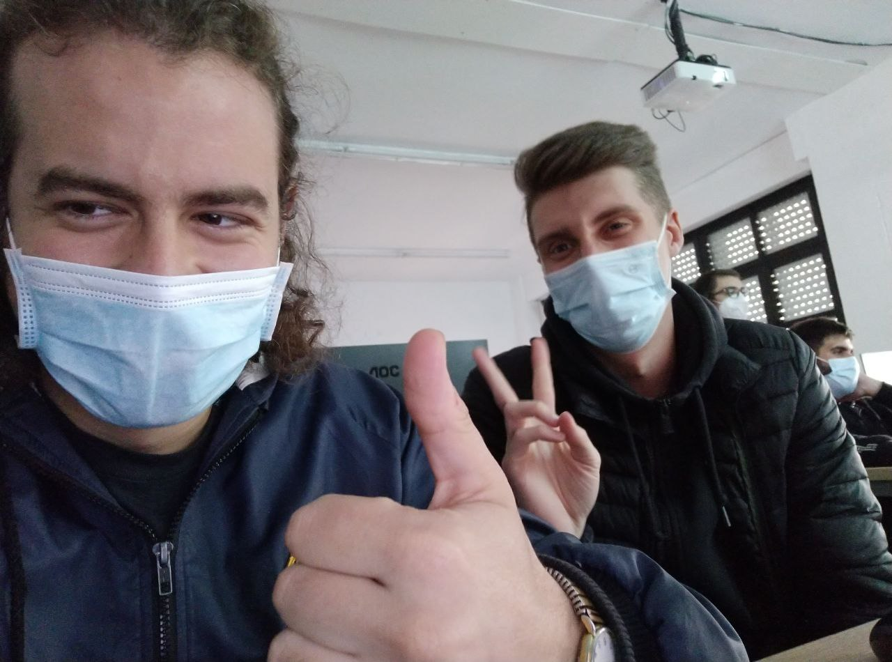

Aquí vemos a los integrantes del equipo de Associate, Rodrigo y Mario.

### Primeros pasos
Creamos una base de datos e instalamos los módulos del sitio web y del proyecto (por el momento).
Para crear el sitio web y dotarle de personalización podemos instalar un tema, que es el siguiente paso que vamos a dar.

### Instalar un tema
Para ello, entramos en la base de datos como administradores para tener un menú enriquecido.
Descargamos un tema gratuito desde la web, por ejemplo de "INTRODUCIR WEB".
Nos metemos desde el usuario de Odoo en la línea de comandos y vamos a addons, y comandamos:
sudo unzip ~/Descargas/tema.zip 
    Tener en cuenta que el ~ es como llamar al home del usuario actual
sudo chown odoo:odoo -R tema/
    Le acabamos de dar propiedad a Odoo los permisos sobre el tema de forma recursiva.

Ahora vamos a Aplicaciones > Actualizar lista de aplicaciones.
Vamos al Sitio Web, escogemos un tema y ya aparece nuestro tema, lo escogemos para aplicarlo.
El tema ya está instalado.
En las opciones de edición bajamos y clickamos en switch theme, nos lleva a una página y comprobamos que tenemos nuestro tema nuevo 
en funcionamiento.

### Creación del sitio web
Vamos a crear nuestro sitio web, Associate. Teniendo en cuenta que vamos a ayudar a asociaciones a realizar sus gestiones, vamos a
crear tres apartados en la web y la página de inicio. Desde el inicio podemos acceder a los otros tres.

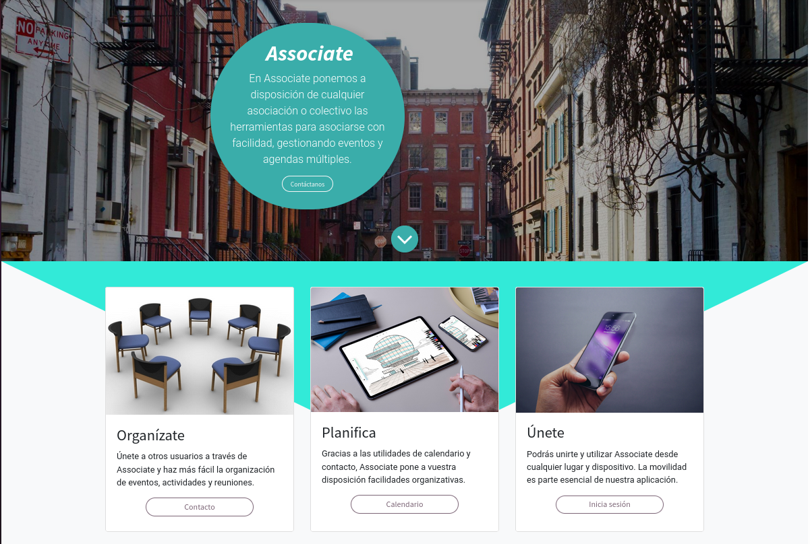

1.  Un apartado de contacto.
    Para que los usuario se pongan en contacto con nosotros en caso de problemas o dudas. En este apartado hemos creado un formulario para las exposiciones y mensajes, y mostramos la ubicación de nuestra empresa (Albacete) en el lateral.

    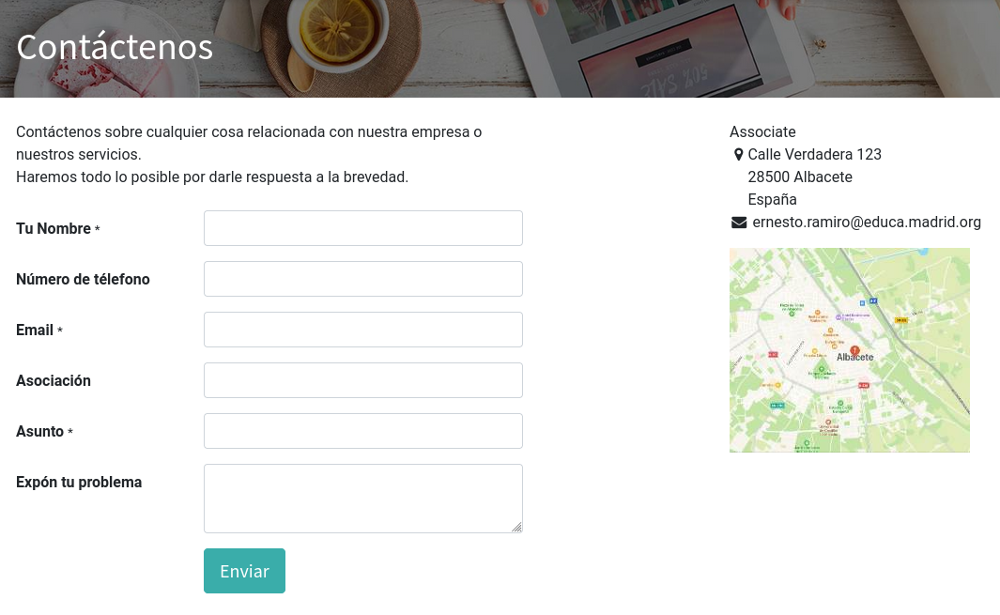

2. Un apartado de registro e inicio de sesión.
    Para que los usuarios puedan acceder a sus eventos y calendarios.

    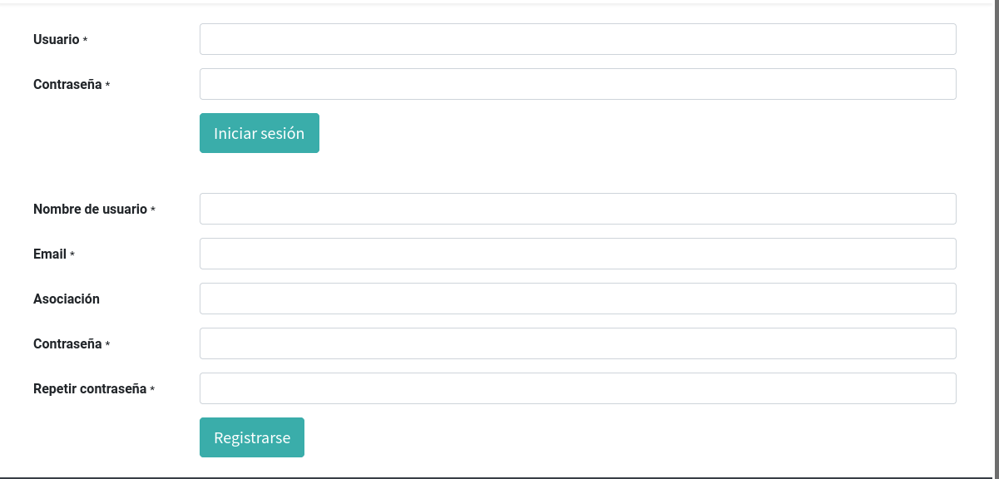

3. Un apartado de calendario.
    Donde los usuarios podrán gestionar los eventos a los que están suscritos desde su asociación y organizarse de forma visual.

    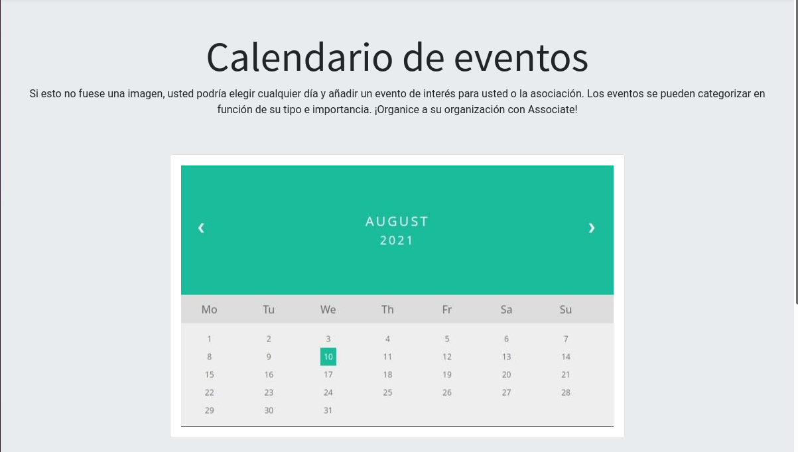

Todos los cambios que estamos realizando en nuestra web a nivel de código (HTML, SCSS y JavaScrypt) están indicados con la siguiente
nomenclatura: **dam2_roma_nombregenérico**. "roma" indica Rodrigo y Mario, los autores de esta práctica, y en caso de encontrarse las etiquetas
*ro* o *ma* separadas, esto indicaría que sólo uno de ellos habría realizado ese avance. No va a ser lo común.

Lo primero ha sido añadir y cambiar la página a través de las funcionalidades de edición que nos proporciona el propio Odoo. Cuando la capacidad 
de personalización nos ha limitado, hemos tocado algunas partes del código.

Los cambios realizados en el código se podrán comprobar a través de un comando grep en la ruta de Odoo, y los hemos acometido fundamentalmente para añadir botones, cambiar su estilo y añadir unas pequeñas funciones en JavaScrypt para redirigir al usuario a los distintos apartados de la web. 

# 2. Crea un tablero para trabajar con metodologías ágiles y organizar el trabajo
Descargamos el módulo "Proyectos" y creamos un nuevo proyecto. Como estamos preparando un sistema para asociaciones vecinales, vamos a ponernos en la piel de una y vamos a crear el evento "Día del libro". Organizamos nuestras tareas en etapas para la consecución de nuestros objetivos.

Odoo nos permite organizar nuestros proyectos por columnas y subtareas. A cada tarea le podemos asignar un estado y una fecha, de forma que sea más sencillo para los usuarios realizar un seguimiento de la evolución de un proyecto. En nuestro caso, nuestras columnas son Recogida de libros, Preparación y Acto público.

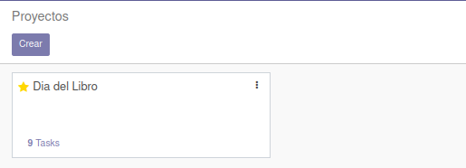

# 3. Definir productos o servicios
Vamos a situarnos en la aplicación de Ventas, en el apartado de productos. Siguiendo con el ejemplo asociativo, hemos decidido vender una serie de camisetas con fines solidarios. Para ello vamos a crear un producto de nombre "camiseta solidaria" que va a tener un P.V.P de 5 euros. Ahora podemos ver cómo las camisetas están junto a resto de productos que Odoo muestra como ejemplos. Podemos asociar al producto una imagen para facilitar el trabajo, así como añadir los detalles necesarios. 

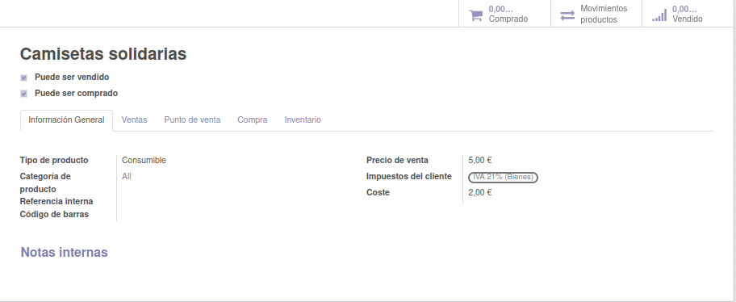

# 4. Define una agenda en el calendario
Ahora accedemos al calendario y creamos una reunión para el día 15, en este caso va a ser una reunión con la asamblea local. Lo importante es tener en cuenta que Odoo nos permite crear eventos con varios niveles de detalle, indicando la fecha y la hora de forma que podamos verlos en contexto en un calendario. 

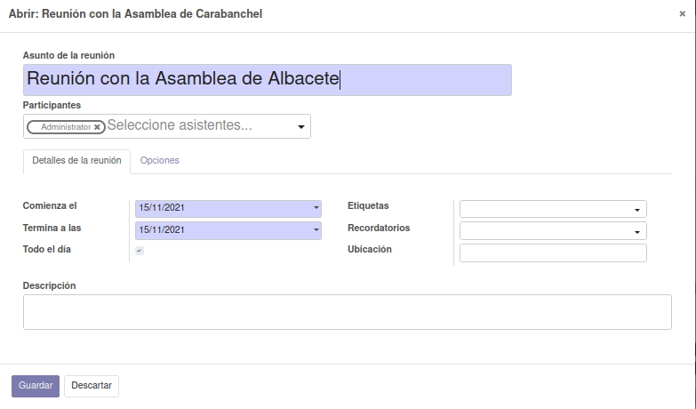

# 5. Crea eventos para campañas de marketing
Desde el módulo Eventos vamos a poder añadir un evento que sea visible en la página web. En nuestro caso vamos a anunciar una charla sobre asociacionismo desde Associate. Vamos a poder elegir las fechas de inicio y fin, quién es organizador y quién responsable, dónde ocurre y cuánta gente puede registrarse para acudir. 

En los eventos tenemos voletos que sirven para los registros y a los que podemos asociar un precio, aunque no sea nuestro caso.

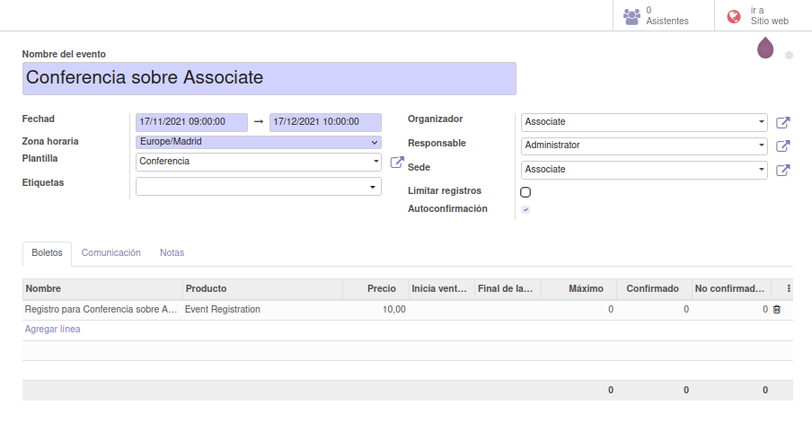

# 6. Define un sistema de comunicación interno
Vamos a proporcionarle a nuestros usuarios una forma de comunicarse dentro de los márgenes de Odoo. Instalaremos el módulo conversaciones y, una vez allí, podremos organizar un sistema eficiente de chats generales y personales. 

Los canales son espacios donde varios usuarios pueden tener un chat común, igual que en un grupo de Whatsapp o Discord, de manera que puedan discutir colaborativamente sobre problemáticas que les conciernen a todos. Existen canales privados que sólo pueden ser vistos por aquellas personas que están dentro. Nosotros hemos creado un canal general para todos los miembros de la asociación, uno abierto para la tesorería y uno privado para la junta directiva como ejemplo.

Existe, no obstante, la posibilidad de escribir de forma privada a un sólo usuario y mantener la comunicación con él a través de este módulo en el apartado de Mensajes directos. Puedes invitar a nuevos usuarios y filtrar  mensajes.

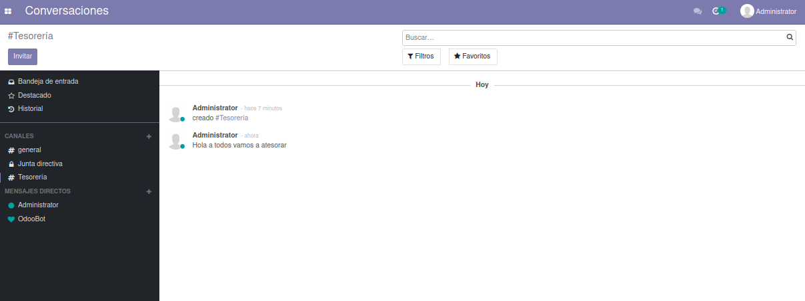

# 7. Gestiona contactos y otros datos
Podemos gestionar nuestros contactos a través del módulo específico que nos ofrece Odoo. Una vez instalamos la aplicación podemos ver una libreta con los contactos que hemos ido creando de una forma u otra hasta el momento. Al haber realizado la tarea La Taberna de Moe tenemos varios ejemplos que el módulo ha asociado como contactos (Barnie, la empresa Duff, el Administrador de Odoo). 

Ahora vamos a crear un contacto siguiendo el ejemplo de los otros apartados. En el caso de nuestra asociación de ejemplo, vamos a registrar el proveedor al que vamos a encargar nuestras camisetas. En nuestro caso vamos a citar a Ecamisetas.com que es el primero en aparecer en el navegador y que además aparece como sugerencia en el buscador de Odoo. Nos coloca el logo automática. Rellenamos los campos que faltan y ya tenemos nuestro contacto.

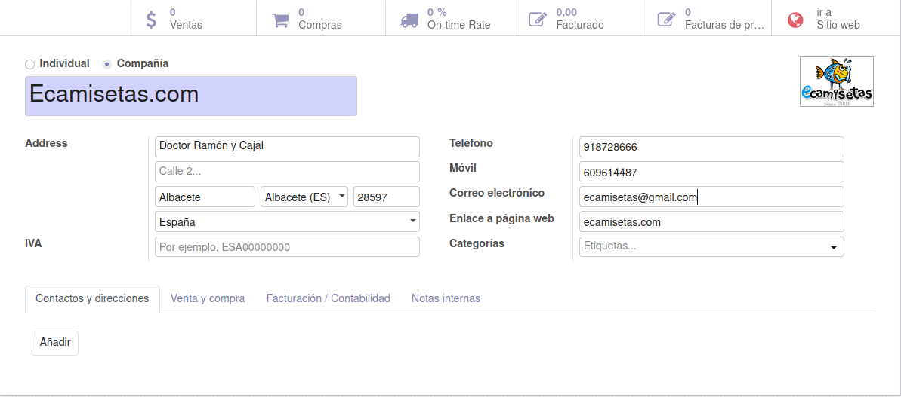

### Clonación del proyecto en VSCode
Realizamos un fork y lo introducimos en Visual Studio Code, ubicándolo donde queramos en nuestro sistema de ficheros para editarlo. Vamos a utilizar el sistema markdown para documentar. Este documento es fruto de este apartado. ¿Suficientemente recursivo?

El comando que vamos a utilizar Visual Studio Code con permisos de edición será:
*sudo code /opt/odooo --user-data-dir="." --no-sandbox*

Vamos a descargar la base de datos desde el localhost/8069 y la vamos a encriptar con gpg mediante el siguiente comando:
*gpg -c AssociateEtcEtc.zip*

Nuestra contraseña será '123456'. Si algún delincuente digital está leyendo esto en github le animamos a montar un sistema de gestión empresarial.

Copiamos la base de datos a otp/odoo/dumps mediante el comando cp. Visual Studio Code nos pide commit así que se lo vamos a dar. Es importante (lo hemos aprendido con dolor) no actualizar nuestro repositorio en Github desde la terminal y Visual Studio a la vez, pues originamos un problema de permisos que no somos capaces de solucionar.

Los seguidos para realizar este proyecto colaborativo en Github son los siguientes: 

**Paso 1:** Usuario 1 sube a Github el repositorio y da permiso a Usuario 2 como colaborador.

**Paso 2:** Usuario 2 acepta y clona el repositorio de Usuario 1.

**Paso 3:** Crea una rama nueva (mejor el nombre de la funcionalidad).

**Paso 4:** Una vez hecha hacemos un git push nombre de la rama.

**Paso 5:** El Usuario 1 va a hacer pull para unirlo a proyecto. No debería haber un conflicto. Si hace merge se unen las ramas. 

Si queremos mantener datos fuera del repositorio los meteremos dentro de la carpeta .Gitignore.
Para evitar que estos sean espiados utilizaremos: git rm -r -cached.